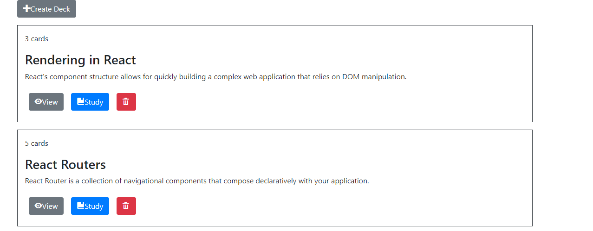
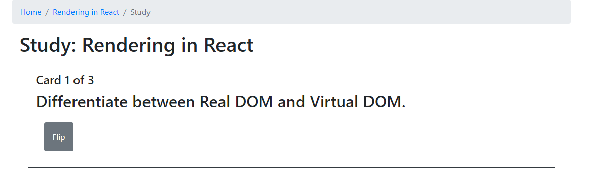
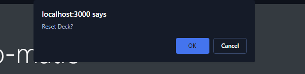
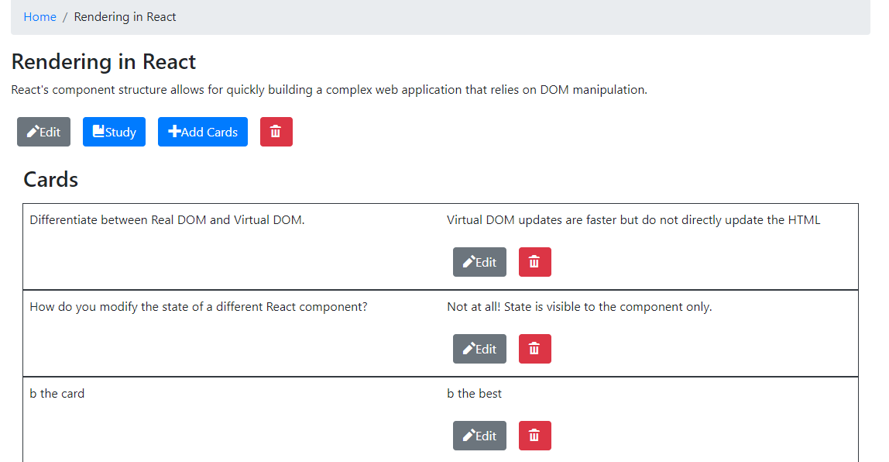

# Flashcard Study Application

Use this application to create decks of flashcard to help you study.

## Installation

Install this Flashcard App with npm

```bash
  git clone https://github.com/Mculler25/Flashcard-App 
  npm install Flashcard-App
  cd Flashcard-App
```
    
## Home Page



This page will list your decks. Here you can navigate to the study page, the deck page, or delete and create new decks.
## Study Page



The study page runs at the route /decks/:deckId/study.

On this page you can hit the flip button to navigate between the front and back of the card. Hit next to switch between cards.



When you navigate to the end of the deck a window will pop up asking if you want to reset the deck or not. If you reset the deck it will start the the beginning of the deck, If you don't reset the deck you will be redirected to the homepage.
## Deck Page



The deck page is located at the route /decks/:deckId

Here you can navigate to the study page, add cards to your deck, delete cards, and edit cards in your deck.

